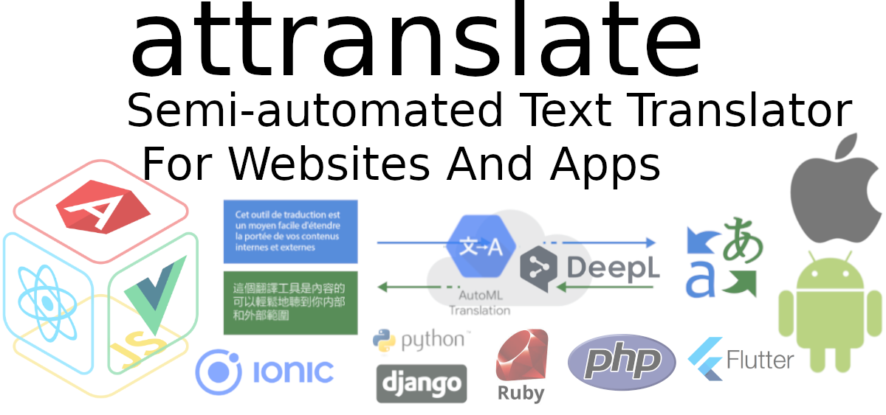

# attranslate: Traductor de texto semiautomático para sitios web y aplicaciones


### [View all Roadmaps](https://github.com/nholuongut/all-roadmaps) &nbsp;&middot;&nbsp; [Best Practices](https://github.com/nholuongut/all-roadmaps/blob/main/public/best-practices/) &nbsp;&middot;&nbsp; [Questions](https://www.linkedin.com/in/nholuong/)
<br/>

<p align="center">
  
</p>

macOS/Ubuntu/Windows: [](https://github.com/nholuongut/attranslate/actions?query=branch%3Amaster)

`attranslate` es una herramienta para sincronizar archivos de traducción, incluyendo JSON/YAML/XML y otros formatos.
A diferencia de los servicios de pago, cualquier desarrollador puede integrar `attranslate` en cuestión de minutos.
`attranslate` dejará las traducciones existentes sin cambios y solo sincronizará las nuevas traducciones.

Opcionalmente `attranslate` trabaja con servicios de traducción automática.
Por ejemplo, supongamos que un servicio de traducción logra un 80% de traducciones correctas.
Con `attranslate`, una solución rápida del 20% restante puede ser más rápida que hacer todo a mano.
Aparte de eso, `attranslate` admite traducciones puramente manuales o incluso conversiones de formato de archivo sin cambiar el idioma.

# Funciones

## Conservar traducciones manuales

`attranslate` reconoce que las traducciones automáticas no son perfectas.
Por lo tanto, siempre que no esté satisfecho con los resultados producidos, `attranslate` le permite simplemente sobrescribir textos en sus archivos de destino.
`attranslate` nunca sobrescribirá una corrección manual en ejecuciones posteriores.

## Servicios disponibles

`attranslate` admite los siguientes servicios de traducción; Muchos de ellos son gratis:

- `openai`: Utiliza un modelo como ChatGPT; gratis hasta un límite
- [google-translate](https://cloud.google.com/translate): Necesita una cuenta de GCloud; gratis hasta un límite
- [azure](https://azure.microsoft.com/en-us/services/cognitive-services/translator-text-api/): Necesita una cuenta de Microsoft; cuesta dinero
- `sync-without-translate`: No cambia el idioma. Esto puede ser útil para convertir entre formatos de archivo o para mantener diferencias específicas de la región.
- `manual`: Traducir textos manualmente

# Ejemplos de uso

Traducir un solo archivo es tan simple como la siguiente línea:

    attranslate --srcFile=json-simple/en.json --srcLng=English --srcFormat=nested-json --targetFile=json-simple/de.json --targetLng=German --targetFormat=nested-json --service=openai

Si tiene varios idiomas de destino, necesitará varias llamadas a `attranslate`.
Puede escribir algo como el siguiente script:

```bash
# Este ejemplo traduce un archivo JSON en inglés a español y alemán.
BASE_DIR="json-advanced"
SERVICE_ACCOUNT_KEY="gcloud/gcloud_service_account.json"
COMMON_ARGS=( "--srcLng=en" "--srcFormat=nested-json" "--targetFormat=nested-json" "--service=google-translate" "--serviceConfig=$SERVICE_ACCOUNT_KEY" )

# instalar attranslate si aún no está instalado
attranslate --version || npm install --global attranslate

attranslate --srcFile=$BASE_DIR/en/fruits.json --targetFile=$BASE_DIR/es/fruits.json --targetLng=es "${COMMON_ARGS[@]}"
attranslate --srcFile=$BASE_DIR/en/fruits.json --targetFile=$BASE_DIR/de/fruits.json --targetLng=de "${COMMON_ARGS[@]}"
```

Del mismo modo, puede utilizar `attranslate` para convertir entre formatos de archivo.
Ver [scripts de ejemplo](https://github.com/nholuongut/attranslate/tree/master/sample-scripts) para más ejemplos.

# Guía de integración

En primer lugar, asegúrese de que [nodejs](https://nodejs.org/) está instalado en el equipo.
Una vez que tengas `nodejs`, puede instalar `attranslate` Vía:

`npm install --global attranslate`

Alternativamente, si usted es un desarrollador de JavaScript, entonces debe instalar `attranslate` Vía:

`npm install --save-dev attranslate`

A continuación, debe escribir un script específico del proyecto que invoque `attranslate` para sus archivos específicos.
Ver [scripts de ejemplo](https://github.com/nholuongut/attranslate/tree/master/sample-scripts) para obtener orientación sobre cómo traducir los archivos específicos del proyecto.

# Opciones de uso

Correr `attranslate --help` para ver una lista de opciones disponibles:

```
    Usage: attranslate [options]

    Options:
      --srcFile <sourceFile>              The source file to be translated
      --srcLng <sourceLanguage>           A language code for the source language
      --srcFormat <sourceFileFormat>      One of "flat-json", "nested-json",
                                          "yaml", "po", "xml", "ios-strings",
                                          "arb", "csv"
      --targetFile <targetFile>           The target file for the translations
      --targetLng <targetLanguage>        A language code for the target language
      --targetFormat <targetFileFormat>   One of "flat-json", "nested-json",
                                          "yaml", "po", "xml", "ios-strings",
                                          "arb", "csv"
      --service <translationService>      One of "openai", "manual",
                                          "sync-without-translate",
                                          "google-translate", "azure"
      --serviceConfig <serviceKey>        supply configuration for a translation
                                          service (either a path to a key-file or
                                          an API-key)
      --matcher <matcher>                 An optional feature for string replacements. One of "none", "icu", "i18next",
                                          "sprintf" (default: "none")
      -v, --version                       output the version number
```

# 🚀 I'm are always open to your feedback.  Please contact as bellow information:
### [Contact ]
* [Name: nho Luong]
* [Skype](luongutnho_skype)
* [Github](https://github.com/nholuongut/)
* [Linkedin](https://www.linkedin.com/in/nholuong/)
* [Email Address](luongutnho@hotmail.com)
* [PayPal.me](https://www.paypal.com/paypalme/nholuongut)


[](https://ko-fi.com/nholuong)

# License
* Nho Luong (c). All Rights Reserved.🌟
